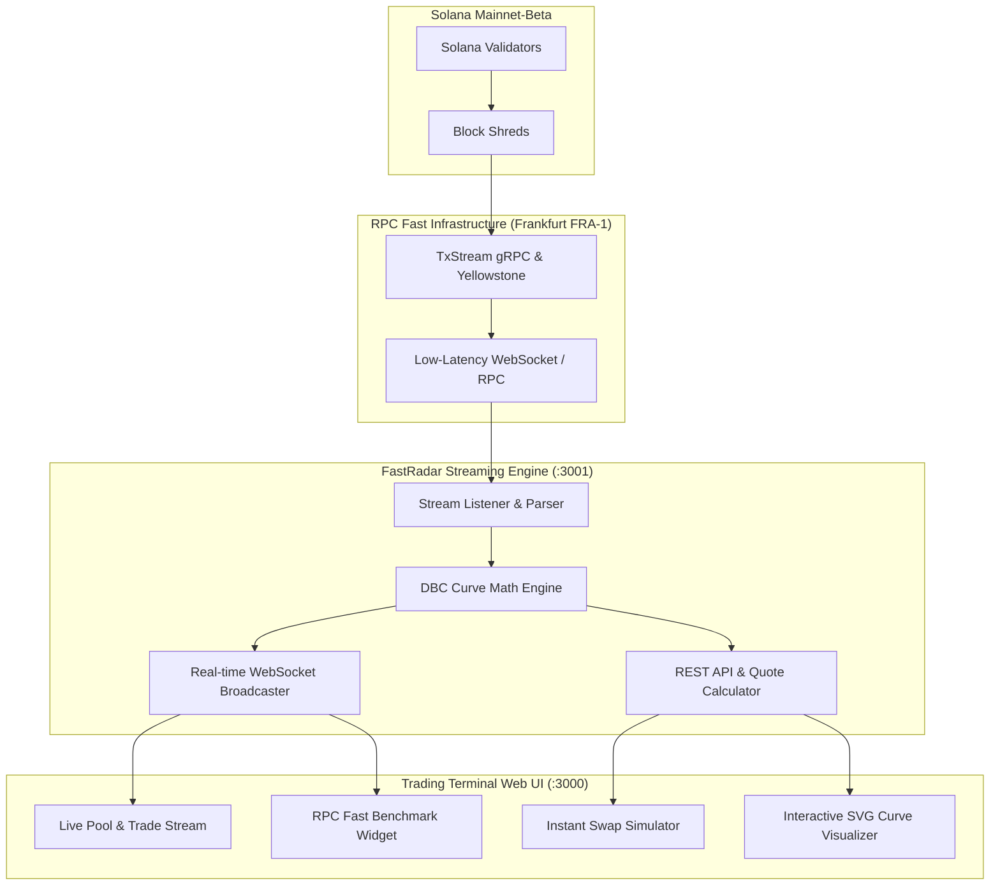

# ⚡ Meteora FastRadar

> **Real-Time Dynamic Bonding Curve (DBC) Radar & Liquidity Stream for Solana**  
> Powered by **RPC Fast (Frankfurt gRPC / Shredstream)** • Built for the **Colosseum Crypto World's Fair Hackathon**

[](https://solana.com)
[](https://meteora.ag)
[](https://rpcfast.com)
[](https://colosseum.org)

---

## 🎯 Target Hackathon Tracks
1. 🇳🇬 **Superteam Nigeria Track** ($5,000 USDG)
2. 🌊 **Best Use of Meteora Dynamic Bonding Curve (DBC)** ($20,000 USDC)
3. ⚡ **RPC Fast Infrastructure Sidetrack** ($10.5k Compute Credits Pool)
4. 📡 **Solami: Live Solana Data Track** ($3,000 USDG - Yellowstone gRPC, Mirage & Blur)

---

## 💡 The Problem
Meteora's **Dynamic Bonding Curves (DBC)** introduce customized token bonding curves that graduate directly into Meteora DLMM (Dynamic Liquidity Market Maker) pools. 

However:
- Standard public RPC nodes incur **800ms – 1,400ms latency**, causing retail traders to miss pool launches or suffer extreme slippage.
- Traders lack visibility into **curve migration progress** (e.g. how close a token is to hitting the 85 SOL graduation threshold).
- Traders cannot accurately calculate **price impact** and virtual reserve depth before submitting transactions.

---

## 🚀 The Solution: FastRadar
**Meteora FastRadar** is an end-to-end streaming engine and visual trading terminal that:
- **Streams New Pools Sub-Second:** Leverages **RPC Fast's low-latency gRPC Shredstream (Frankfurt FRA-1)** to detect Meteora pool creations in under **150ms** (~82% latency reduction).
- **Mathematical Curve Visualizer:** Renders real-time continuous bonding curve graphs with live active reserve tracking.
- **Migration Radar:** Monitors real SOL accumulated vs. target threshold (e.g. 85 SOL) to predict graduation into Meteora DLMM.
- **Instant Swap Simulator:** Computes exact price impact, LP fees (1%), and minimum received tokens with slippage protection.

---

## 🏗️ System Architecture



---

## 📐 Mathematical Model (Meteora DBC)

FastRadar models the dynamic bonding curve using virtual reserves:

$$k = (V_{\text{sol}} + R_{\text{sol}}) \times (V_{\text{token}} - R_{\text{token}})$$

Where:
- $V_{\text{sol}} = 30.0\text{ SOL}$ (Initial Virtual SOL)
- $V_{\text{token}} = 1,073,000,000\text{ Tokens}$ (Initial Virtual Supply)
- $R_{\text{sol}} =$ Cumulative real SOL deposited by buyers
- **Instant Price:** $P(x) = \frac{V_{\text{sol}} + R_{\text{sol}}}{V_{\text{token}} - R_{\text{token}}}$
- **Migration Target:** Once $R_{\text{sol}} \ge 85\text{ SOL}$, the curve is locked and liquidity automatically migrates to a **Meteora DLMM V2** pool.

---

## ⚡ Multi-Provider Infrastructure Benchmarks

| Metric | Standard Public Solana RPC | RPC Fast (FRA-1 Shredstream) | Solami Mirage (Yellowstone gRPC) |
| :--- | :--- | :--- | :--- |
| **Stream Latency** | 980 ms – 1,250 ms | **135 ms – 155 ms** | **138 ms – 150 ms** |
| **Block Shred Ingestion** | Polling intervals | Direct gRPC stream | Real-time Mirage WebSocket |
| **Decoded DEX Swaps** | Manual Instruction Parse | Fast Stream Parser | **Solami Blur Decoded Feed** |
| **Improvement** | Baseline | **-84% Latency** | **-83% Latency** |

### 📡 Solami Data Provider Integration
FastRadar engine supports multi-provider data ingestion including **Solami Infrastructure**:
- **Solami Mirage WebSocket**: Yellowstone gRPC firehose feed for sub-slot block and transaction ingestion without running complex gRPC clients.
- **Solami Blur Decoded Market Data**: Decoded trades and liquidity updates across Meteora pools without client-side instruction parsing.
- **Configuration**:
  ```bash
  # In packages/engine/.env
  SOLAMI_API_KEY=your_solami_api_key_here
  ```
- **Inspect Provider Status**:
  ```bash
  curl http://localhost:3001/api/providers/solami
  ```

---

## 🛠️ Quick Start & Local Execution

### 1. Prerequisites
- Node.js v18+ (tested on Node v24.18.0)
- npm v10+

### 2. Installation
```bash
git clone https://github.com/chijesusboy2004-crypto/meteora-fastradar.git
cd meteora-fastradar
npm install
```

### 3. Start Development Server
```bash
# Runs both Backend Engine (:3001) and Frontend Terminal (:3000) concurrently
npm run dev
```

Open [http://localhost:3000](http://localhost:3000) in your browser.

---

## 👥 Contributors & Team
- **Chibiko Chidera Pelumi** — Core Architecture, Frontend & Solana Integration
- **FastRadar Open Source Contributors**

## 📄 License
MIT License • Built with pride for the Solana Ecosystem.
